# SHA-256 File Hash Checker


Homework 1 for CYBI 2326. The assignment was to build a simple PyQt6 app, written in an OOP way, that opens any file, gets its SHA-256 hash, and compares it to a hash you paste in.

<p align="center">
  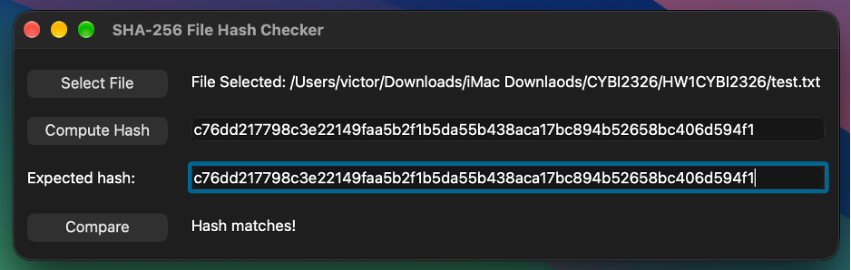
</p>

---

## What a hash is

Memory hint for me: a hash is a fingerprint for a file's contents.

- The same file always gives the same hash, no matter when or where you check it.
- Change even one character and you get a completely different hash.
- Every SHA-256 hash is 64 characters long, whether the file is tiny or huge.
- It only goes one way. You can't turn a hash back into the file.

<details>
<summary><b>Example</b></summary>

<br>

Three almost identical inputs, three completely different hashes:

| Input | SHA-256 Hash |
|---|---|
| `Hello Victor` | `412bc91df603f5bbd20eecdecf9f4ff7f75a1e20787919875d9e3dc8de14691d` |
| `hello Victor` | `ba53c743757c0ebb3835974f93660638ba2b471a1b7de13d236ff637da3b331d` |
| `Hello Victor!` | `59731b35e2ac0630a179b6e89fd53f4c38fc44fb22d75a217adfeeb9b0b95292` |

</details>

### Where it's used

- **Downloads:** sites post a file's hash so you can check your copy wasn't corrupted or tampered with. That's basically what this app does.
- **Passwords:** websites store a hash of your password instead of the actual password.
- **Forensics:** investigators hash evidence to prove it was never changed.
- **Git:** every commit is identified by a hash.
- **Bitcoin:** SHA-256 links each block to the one before it.

---

## How the app works

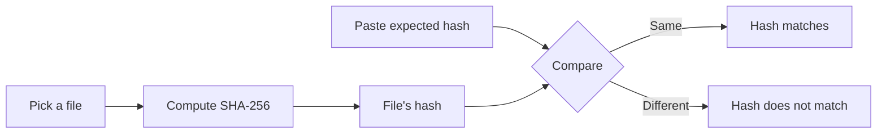

1. **Select File:** pick any file.
2. **Compute Hash:** shows the file's SHA-256 hash.
3. **Expected hash:** paste the hash you want to check against.
4. **Compare:** tells you if they match.

Notes on how I built it:

- The file is read in 4096-byte chunks so big files don't use up a lot of memory.
- The pasted hash gets `.strip().lower()` before comparing, so extra spaces or capital letters don't cause a false mismatch.
- If the file can't be read (deleted, no permission), the app shows a message instead of crashing, and clears the old hash so Compare can't use it.
- Picking a new file also clears the old hash for the same reason.

---

## Running it

Requires Python 3.9 or newer and PyQt6. `hashlib` comes with Python.

```bash
python3 -m pip install PyQt6
python3 hash_checker.py
```

> [!NOTE]
> On my Mac, VS Code was using the built-in Python at `/usr/bin/python3`, which didn't have PyQt6. Installing it with `/usr/bin/python3 -m pip install --user PyQt6` fixed it.

---

## Testing

Tested on macOS with Python 3.9.6, using `test.txt` (contains `File for testing!` with no line break at the end). All tests passed.

| # | What I did | What should happen | Screenshot |
|---|---|---|---|
| 1 | Launched the app | Empty window, "No File Selected" | [01](screenshots/01-launch.png) |
| 2 | Clicked Compare first | "Please compute the hash first." | [02](screenshots/02-compare-too-early.png) |
| 3 | Clicked Compute Hash with no file | "Please select a file first." | [03](screenshots/03-no-file.png) |
| 4 | Selected `test.txt` | File path shows up | [04](screenshots/04-file-selected.png) |
| 5 | Clicked Compute Hash | `c76dd217...bc406d594f1` | [05](screenshots/05-hash-computed.png) |
| 6 | Ran `shasum -a 256 test.txt` | Same hash as the app | [06](screenshots/06-shasum-verify.png) |
| 7 | Clicked Compare with the box empty | "Please paste a hash to compare." | [07](screenshots/07-empty-input.png) |
| 8 | Pasted the hash, clicked Compare | "Hash matches!" | [08](screenshots/08-match.png) |
| 9 | Changed the last character, clicked Compare | "Hash does not match." | [09](screenshots/09-no-match.png) |
| 10 | Deleted `test.txt`, clicked Compute Hash | "Could not read this file." and hash cleared | [10](screenshots/10-unreadable.png) |
| 11 | Clicked Compare after that | "Please compute the hash first." | [11](screenshots/11-no-stale-hash.png) |

Test 6 is the important one. macOS's own `shasum` tool gave the exact same hash as my app, so the hashing is correct.

To recreate the test file exactly (using `echo` adds a line break, which changes the hash):

```bash
printf 'File for testing!' > test.txt
```

<details>
<summary><b>All screenshots</b></summary>

<br>

**1. Launch**
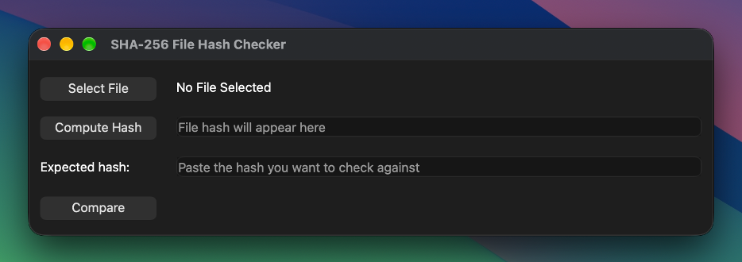

**2. Compare too early**
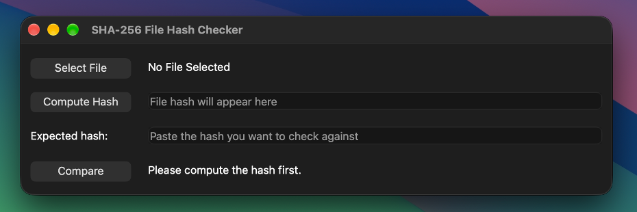

**3. No file selected**
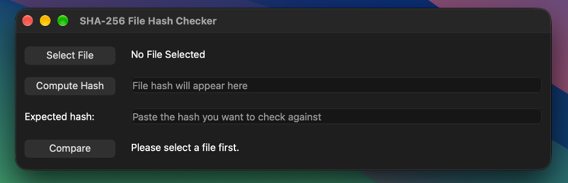

**4. File selected**
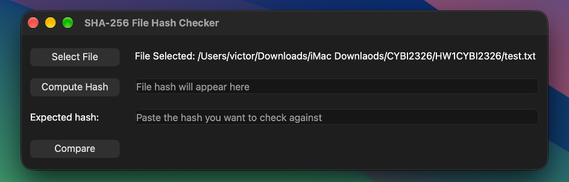

**5. Hash computed**
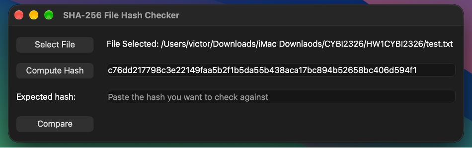

**6. Checked with shasum**
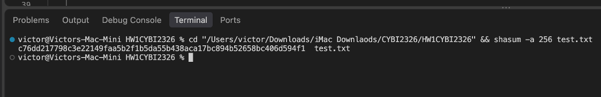

**7. Empty input**
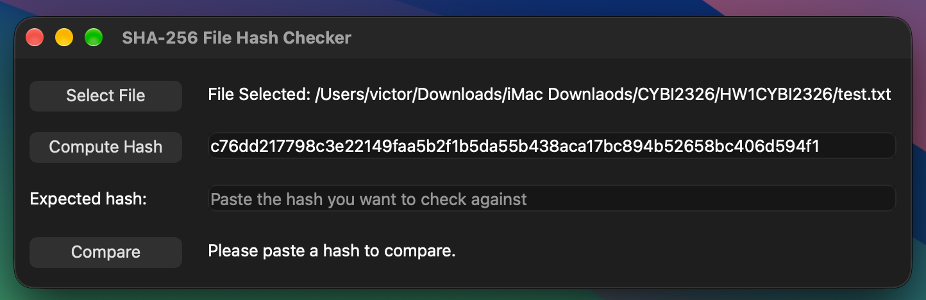

**8. Match**


**9. No match**
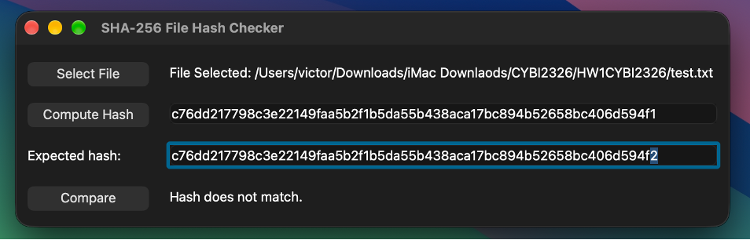

**10. Unreadable file**
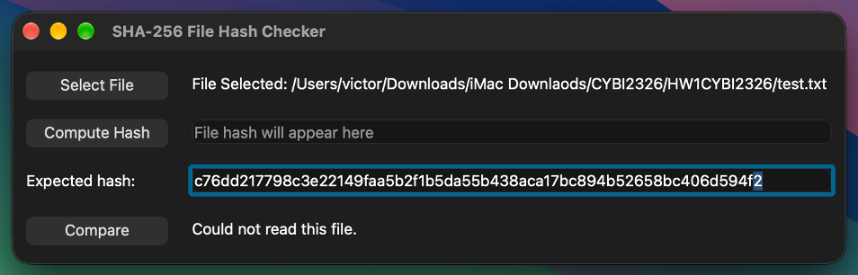

**11. No stale hash**
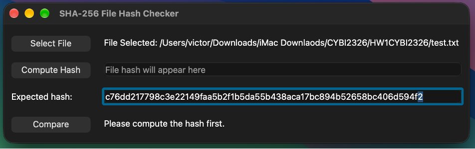

</details>

---

## Files

```
hash_checker.py   the app
README.md         this file
test.txt          file used for testing
screenshots/      test screenshots
```

---

## Author

Victor Chairez
